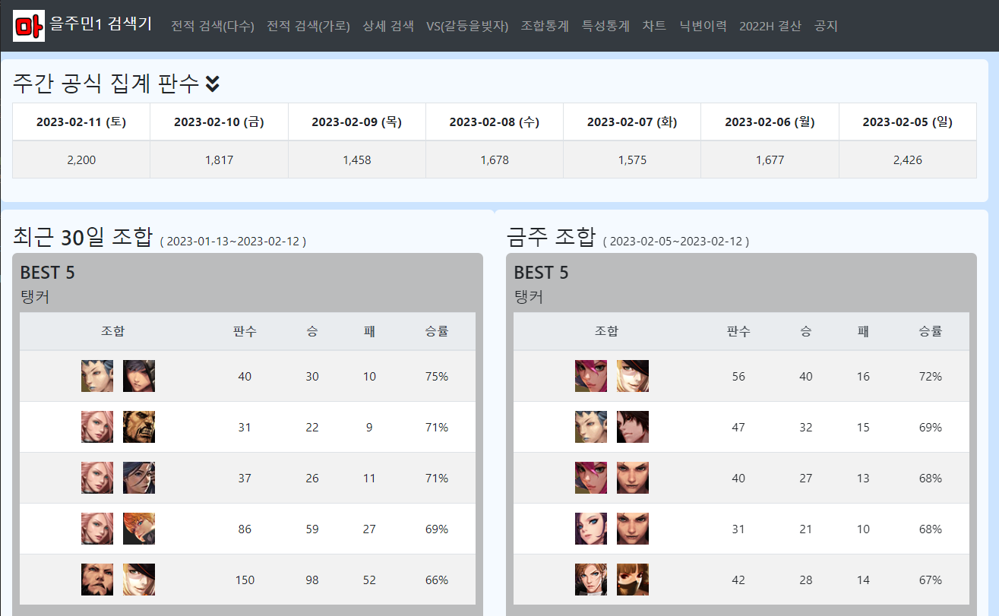
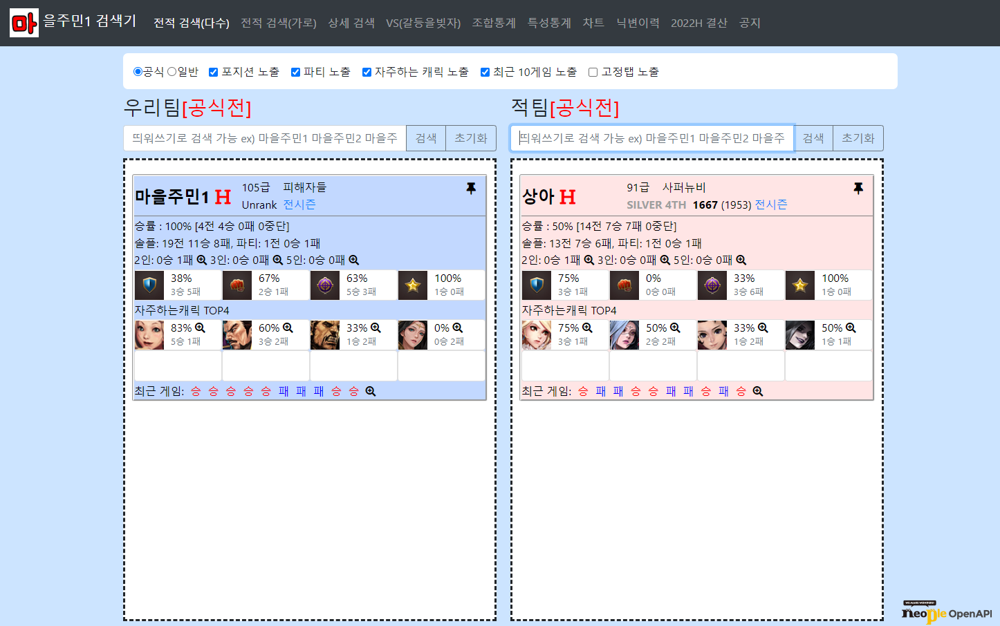

# cyphers
마을주민1 사이퍼즈 전적 검색기

## 소개 
> 네오플 온라인 게임 사이퍼즈의 전적을 검색할 수 있는 웹사이트입니다.   
> 전적검색, 조합통계, 특성통계, 시즌통계, 맵별 승률, 타인과의 전적 등을 검색 할 수 있습니다. 
> 네오플 API를 이용하여 만들었습니다. 

메인페이지 - 통계

전적 검색(다수)

## 사이트 
> doseh.co.kr 또는 cyphers.doseh.co.kr.  
> 네이버 또는 구글에서 "마을주민1 검색기" 검색

- 메뉴 
  - <a href='http://doseh.co.kr/'> 메인페이지 (통계) </a>
  - <a href='http://doseh.co.kr/user/userSearch'> 전적 검색(다수) </a>
  - <a href='http://doseh.co.kr/user/userSearch_vertical'> 전적 검색(가로) </a>
  - <a href='http://doseh.co.kr/user/userDetail'> 상세 검색 </a>
  - <a href='http://doseh.co.kr/user/userVs'> VS(갈등을빚자) </a>
  - <a href='http://doseh.co.kr/combi/combi'> 조합통계 </a>
  - <a href='http://doseh.co.kr/position/positionAttr'> 특성통계 </a>
  - <a href='http://doseh.co.kr/rankChart/userChart'> 차트 </a>
  - <a href='http://doseh.co.kr/history/nicknameHistory'> 닉변이력 </a>
  - <a href='http://doseh.co.kr/stats/stats2022h'> 2022H 결산 </a>
  - <a href='#'> 공지(네이버블로그) </a>

